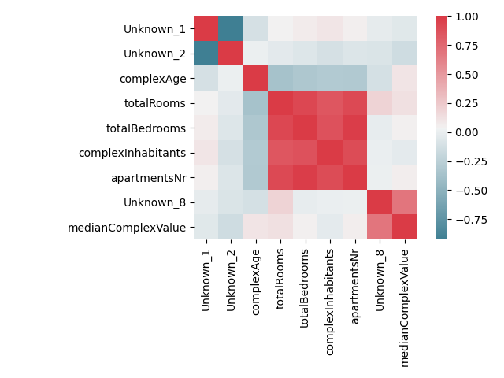
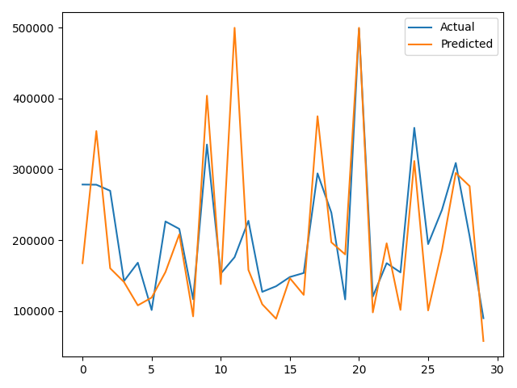

# Linear Regression
## Description
This program is based on multiple linear regression which the main scope 
is to predict house price based on a set of data such as: `complexAge, totalRooms, totalBedrooms,complexInhabitants, apartmentsNr,  medianComplexValue`.
Input data file is stored in _resoursce_ folder - it is a txt file.

## Data Processing
For computing linear regression and process input data the default tools were used: `pandas , sklearn`.
In order to interpret data, it was analyzed from the graphical stand point of view, using `matplotlib and seaborn libraries`.



## Statistic Result
For accuracy measurement is used 3 methods: **Explained Variance Score, RMSE ans R2 Score**.
Trained model has an accuray about 60%
```
{'variance_score': 0.64, 'rmse': 68589.95, 'r2_score': 0.64}
```


## Installation
You can just clone it and run it if you have python installed on your machine, after navigating to the project folder.
```
https://github.com/FilipAdrian/linear-regression.git
python main.py
```